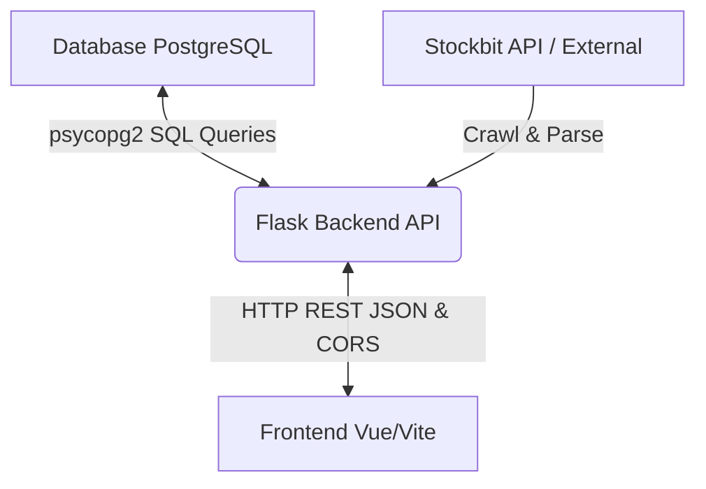

# Panduan Integrasi REST API (Backend - Frontend)

Dokumen ini ditujukan untuk memandu tim Frontend Vue/Vite dalam menghubungkan aplikasi mereka ke Flask Backend REST API.

---

## 📡 1. Spesifikasi Koneksi & CORS
*   **Base URL Backend**: `http://localhost:8080` atau `http://127.0.0.1:8080`
*   **CORS (Cross-Origin Resource Sharing)**: **Sudah diaktifkan** di backend. Tim Frontend yang menjalankan dev server di `http://localhost:5173` dapat langsung mengirimkan HTTP request (menggunakan `axios` atau `fetch`) tanpa khawatir terblokir oleh kebijakan Same-Origin Policy browser.

---

## 🛠️ 2. Daftar Endpoint & Format Response

### A. Health & Token Status (Cek Status Server)
*   **Endpoint**: `/health`
*   **Method**: `GET`
*   **Response (200 OK)**:
    ```json
    {
      "status": "ok",
      "token_status": "valid",
      "token_expires_in": "1j 45m"
    }
    ```

### B. Manual Login (Memperbarui Token Sesi Stockbit)
*   **Endpoint**: `/auth/login`
*   **Method**: `GET`
*   **Response (200 OK)**:
    ```json
    {
      "message": "Login berhasil, token disimpan di cache",
      "token_expires_in": "1j 59m"
    }
    ```

### C. Informasi Snapshot Saham (Stock Info)
*   **Endpoint**: `/stock-info`
*   **Method**: `GET`
*   **Query Parameters**:
    *   `symbol` (Wajib, String): Kode ticker saham. **Hanya menerima 5 bank besar**: `BBCA`, `BBNI`, `BBRI`, `BMRI`, `BJBR`.
*   **Response (200 OK)**:
    ```json
    {
      "message": "Data stock info BBCA berhasil disimpan ke DB",
      "symbol": "BBCA",
      "tanggal": "2026-07-06",
      "harga": 6075
    }
    ```

### D. Data Chart & Aliran Dana Asing (OHLC & Foreign Flow)
*   **Endpoint**: `/ohlc`
*   **Method**: `GET`
*   **Query Parameters**:
    *   `symbol` (Wajib, String): Kode saham (`BBCA`, `BBNI`, `BBRI`, `BMRI`, `BJBR`).
    *   `from` (Opsional, format `YYYY-MM-DD`): Tanggal bursa terbaru.
    *   `to` (Opsional, format `YYYY-MM-DD`): Tanggal bursa terlama.
*   **Response (200 OK)**:
    ```json
    {
      "message": "Data OHLC & Foreign Flow untuk BBCA tanggal 2026-07-03 sudah ada di DB (skip crawl)",
      "symbol": "BBCA",
      "total_data": 240
    }
    ```

### E. Aktivitas Ringkasan Broker (Broker Summary)
*   **Endpoint**: `/broker-activity`
*   **Method**: `GET`
*   **Query Parameters**:
    *   `broker_code` (Wajib, String): Contoh `XL`, `YP`.
    *   `from` / `to` (Opsional, format `YYYY-MM-DD`).
*   **Response (200 OK)**:
    ```json
    {
      "broker_code": "XL",
      "date_from": "2026-07-03",
      "date_to": "2026-07-03",
      "message": "Data broker activity untuk XL sudah ada di DB (skip crawl)",
      "total_buy": 100,
      "total_sell": 100
    }
    ```

### F. Transaksi Orang Dalam (Majorholder / Insider)
*   **Endpoint**: `/majorholder`
*   **Method**: `GET`
*   **Query Parameters**:
    *   `date_start` / `date_end` (Opsional, format `YYYY-MM-DD`).
    *   `pages` (Opsional, default `5`).

### G. Monitoring Status Pekerjaan Crawling (Crawl Logs)
*   **Endpoint**: `/crawl-status`
*   **Method**: `GET`
*   **Query Parameters**:
    *   `limit` (Opsional, default `50`): Jumlah riwayat pekerjaan terakhir yang ditampilkan.
*   **Response (200 OK)**:
    ```json
    [
      {
        "id": 16,
        "job_type": "AUTH_LOGIN",
        "target": "username_anda",
        "tanggal_target": null,
        "status": "SUCCESS",
        "records_count": 1,
        "error_message": null,
        "created_at": "2026-07-06 10:45:34"
      },
      {
        "id": 15,
        "job_type": "OHLC",
        "target": "BMRI",
        "tanggal_target": "2026-07-03",
        "status": "SUCCESS",
        "records_count": 240,
        "error_message": null,
        "created_at": "2026-07-06 10:14:58"
      },
      {
        "id": 14,
        "job_type": "BROKER_ACTIVITY",
        "target": "XL",
        "tanggal_target": "2026-07-05",
        "status": "FAILED",
        "records_count": 0,
        "error_message": "Tidak ada data ditemukan (Hari Minggu pasar tutup)",
        "created_at": "2026-07-06 08:25:25"
      }
    ]
    ```

---

## ⚠️ 3. Format Penanganan Error (Error Handling)
Jika terjadi error (misalnya parameter kurang, bursa libur, rate limit API, atau emiten tidak didukung), backend akan mengembalikan format JSON seragam dengan status code HTTP **`400 Bad Request`** atau **`500 Internal Server Error`**:

*   **Contoh Response Error (400 / 500)**:
    ```json
    {
      "error": "Emiten 'TLKM' tidak didukung. Emiten yang didukung hanya: BBCA, BBNI, BBRI, BMRI, BJBR"
    }
    ```
    *Gunakan block `try-catch` di Frontend untuk mengambil properti `.response.data.error` saat menampilkan notifikasi kegagalan.*

---

## 🔄 4. Pipeline Aliran Data (Database -> Backend -> Frontend)

Berikut adalah visualisasi bagaimana data mengalir dari **Database PostgreSQL**, diproses oleh **Flask Backend**, hingga dirender ke **Frontend Vue/Vite**:



### Penjelasan Langkah Demi Langkah (Step-by-Step Flow):

1.  **Request dari Frontend**:
    Pengguna membuka halaman Chart Saham `BBCA` di browser. Vue frontend memicu HTTP Request:
    `GET http://localhost:8080/ohlc?symbol=BBCA`
2.  **Pengecekan Database oleh Backend (Skip Duplicate Filter)**:
    Backend Flask menerima request, lalu menanyakan database PostgreSQL:
    `SELECT COUNT(*) FROM idxsaham.stock_ohlc WHERE symbol = 'BBCA' AND tanggal = '2026-07-03';`
3.  **Kondisi Aliran Data**:
    *   **Kondisi A (Data Sudah Ada)**:
        Jika database mengembalikan `count > 0` (data sudah ada), Backend **melewati (skip) hit API luar**. Backend langsung membaca data historical dari DB dan mengirimkannya kembali ke Frontend dalam format JSON.
    *   **Kondisi B (Data Belum Ada / Kosong)**:
        Jika data kosong (`count = 0`), Backend memanggil API Stockbit luar, mengunduh data mentah, mem-parsing-nya, lalu menyimpannya ke tabel database PostgreSQL. Setelah sukses tersimpan, data tersebut dikirimkan ke Frontend.
4.  **Rendering di Frontend**:
    Frontend menerima array data JSON (misal data OHLC / Volume / Foreign Flow), menyimpannya ke state reaktif Vue (`ref` / `reactive`), dan merendernya ke layar menggunakan library grafik (seperti *ApexCharts*, *Chart.js*, atau *CanvasJS*).

