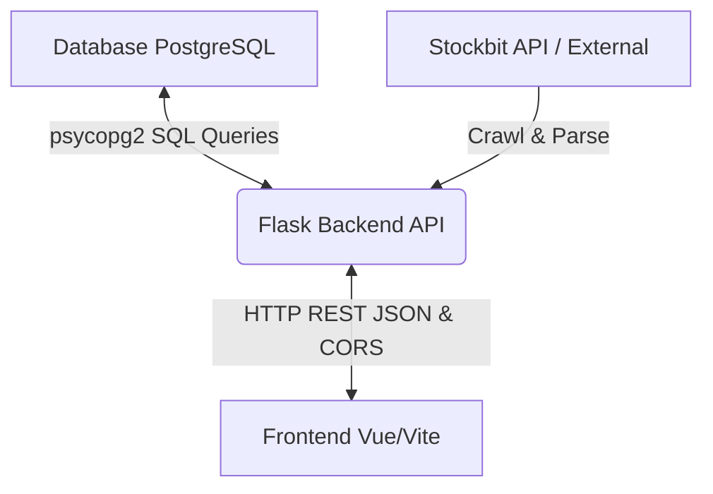

# Panduan Integrasi REST API (Backend - Frontend)

Dokumen ini ditujukan untuk memandu tim Frontend Vue/Vite dalam menghubungkan aplikasi mereka ke Flask Backend REST API.

---

## 📡 1. Spesifikasi Koneksi & CORS
*   **Base URL Backend**: `http://localhost:8080` atau `http://127.0.0.1:8080`
*   **CORS (Cross-Origin Resource Sharing)**: **Sudah diaktifkan** di backend. Tim Frontend yang menjalankan dev server di `http://localhost:5173` dapat langsung mengirimkan HTTP request (menggunakan `axios` atau `fetch`) tanpa khawatir terblokir oleh kebijakan Same-Origin Policy browser.

---

## 🛠️ 2. Daftar Endpoint & Format Response

### A. Endpoint Trigger & Crawling (Untuk memperbarui data)
Endpoint-endpoint ini bertugas memicu crawling data dari Stockbit API ke database lokal.
*   **`/stock-info` (GET)**: Memicu crawl snapshot saham terbaru untuk symbol tertentu (hanya `BBCA`, `BBNI`, `BBRI`, `BMRI`, `BJBR`).
*   **`/ohlc` (GET)**: Memicu crawl data historical OHLC.
*   **`/broker-activity` (GET)**: Memicu crawl ringkasan aktivitas broker.
*   **`/majorholder` (GET)**: Memicu crawl data transaksi insider.

---

## 📊 3. Endpoint Query Data (Untuk Tampilan Tabel & Chart di Frontend)
Endpoint-endpoint baru ini didesain khusus untuk mengambil data mentah dari database lokal PostgreSQL untuk ditampilkan di frontend:

### A. Data Chart & Aliran Dana Asing (OHLC & Foreign Flow)
*   **Endpoint**: `/api/data/ohlc`
*   **Method**: `GET`
*   **Query Parameters**:
    *   `symbol` (Wajib, String): Kode saham (`BBCA`, `BBNI`, `BBRI`, `BMRI`, `BJBR`).
    *   `from` (Opsional, format `YYYY-MM-DD`): Filter batas bawah tanggal.
    *   `to` (Opsional, format `YYYY-MM-DD`): Filter batas atas tanggal.
*   **Response (200 OK)**:
    ```json
    [
      {
        "symbol": "BBCA",
        "tanggal": "2025-07-03",
        "open": 6000.0,
        "high": 6100.0,
        "low": 5950.0,
        "close": 6050.0,
        "volume": 12500000,
        "foreign_buy": 5000000.0,
        "foreign_sell": 4000000.0,
        "foreign_flow": 1000000.0
      }
    ]
    ```

### B. Aktivitas Ringkasan Broker (Broker Summary)
*   **Endpoint**: `/api/data/broker-activity`
*   **Method**: `GET`
*   **Query Parameters**:
    *   `broker_code` (Opsional, String): Kode sekuritas (contoh: `YP`, `XL`).
    *   `symbol` (Opsional, String): Kode saham (contoh: `BBRI`).
    *   `from` / `to` (Opsional, format `YYYY-MM-DD`): Filter rentang tanggal.
    *   `limit` (Opsional, default 100): Jumlah record maksimal.
*   **Response (200 OK)**:
    ```json
    [
      {
        "symbol": "BBRI",
        "broker_code": "YP",
        "broker_type": "DOMESTIC",
        "tanggal": "2026-07-03",
        "nilai_rp": 45000000.0,
        "lot": 900,
        "avg_price": 5000.0,
        "frekuensi": 15,
        "aksi": "BUY"
      }
    ]
    ```

### C. Informasi Snapshot Saham (Stock Info)
*   **Endpoint**: `/api/data/stock-info`
*   **Method**: `GET`
*   **Query Parameters**:
    *   `symbol` (Wajib, String): Kode saham (`BBCA`, `BBNI`, `BBRI`, `BMRI`, `BJBR`).
*   **Response (200 OK)**:
    ```json
    {
      "symbol": "BBCA",
      "nama": "Bank Central Asia Tbk.",
      "tanggal": "2026-07-06",
      "waktu_update": "10:45:00",
      "harga": 6075.0,
      "harga_sebelumnya": 6050.0,
      "perubahan": 25.0,
      "perubahan_persen": 0.41,
      "volume": 1250000,
      "rata_rata": 6060.0,
      "bid_price": 6050.0,
      "bid_volume": 4500,
      "offer_price": 6100.0,
      "offer_volume": 3200,
      "status_pasar": "OPEN"
    }
    ```

### D. Transaksi Orang Dalam (Majorholder / Insider)
*   **Endpoint**: `/api/data/majorholder`
*   **Method**: `GET`
*   **Query Parameters**:
    *   `symbol` (Opsional, String): Kode saham (contoh: `BMRI`).
    *   `limit` (Opsional, default 100): Jumlah record maksimal.
*   **Response (200 OK)**:
    ```json
    [
      {
        "id_trx": "1234567",
        "nama": "DUDI HERMAWAN",
        "symbol": "BJBR",
        "tanggal": "2026-07-02",
        "aksi": "BUY",
        "sebelumnya": 105000.0,
        "sebelumnya_persen": 0.01,
        "sekarang": 115000.0,
        "sekarang_persen": 0.011,
        "perubahan": 10000.0,
        "perubahan_persen": 9.52,
        "harga": "950",
        "sumber": "KSEI",
        "kewarganegaraan": "INDONESIA",
        "broker": "YP",
        "badge": "DIRECTOR"
      }
    ]
    ```

### E. Monitoring Status Pekerjaan Crawling (Crawl Logs)
*   **Endpoint**: `/crawl-status`
*   **Method**: `GET`
*   **Query Parameters**:
    *   `limit` (Opsional, default `50`): Jumlah riwayat pekerjaan terakhir yang ditampilkan.
*   **Response (200 OK)**:
    ```json
    [
      {
        "id": 16,
        "job_type": "AUTH_LOGIN",
        "target": "username_anda",
        "tanggal_target": null,
        "status": "SUCCESS",
        "records_count": 1,
        "error_message": null,
        "created_at": "2026-07-06 10:45:34"
      }
    ]
    ```

---

## 🔄 4. Pipeline Aliran Data (Database -> Backend -> Frontend)


Tim Frontend hanya perlu melakukan query `GET` ke endpoint `/api/data/...` untuk mengambil seluruh isi tabel dan menampilkannya di antarmuka grafik atau tabel.
