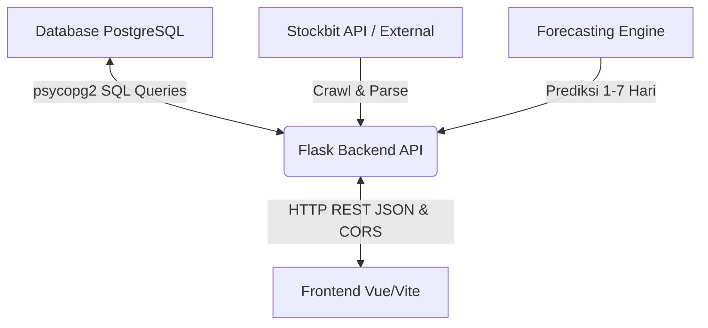

# Panduan Integrasi REST API (Backend - Frontend)

Dokumen ini ditujukan untuk memandu tim Frontend Vue/Vite dalam menghubungkan aplikasi mereka ke Flask Backend REST API.

---

## 📡 1. Spesifikasi Koneksi & CORS
*   **Base URL Backend**: `http://localhost:8080` atau `http://127.0.0.1:8080`
*   **CORS (Cross-Origin Resource Sharing)**: **Sudah diaktifkan** di backend. Tim Frontend yang menjalankan dev server di `http://localhost:5173` dapat langsung mengirimkan HTTP request (menggunakan `axios` atau `fetch`) tanpa khawatir terblokir oleh kebijakan Same-Origin Policy browser.

---

## 🛠️ 2. Endpoint Trigger, Crawling & Scheduler

### A. Endpoint Trigger Crawling Manual
Endpoint-endpoint ini bertugas memicu crawling data dari Stockbit API ke database lokal secara manual.
*   **`/stock-info` (GET)**: Memicu crawl snapshot saham terbaru untuk symbol tertentu (hanya `BBCA`, `BBNI`, `BBRI`, `BMRI`, `BJBR`).
*   **`/ohlc` (GET)**: Memicu crawl data historical OHLC.
*   **`/broker-activity` (GET)**: Memicu crawl ringkasan aktivitas broker.
*   **`/majorholder` (GET)**: Memicu crawl data transaksi insider.

### B. Endpoint Auto Scheduler (Baru)
Digunakan untuk mengontrol crawling otomatis yang berjalan setiap 30 menit pada jam bursa.
*   **`/scheduler/status` (GET)**: Melihat status scheduler saat ini, info hari trading, jam bursa, dan riwayat eksekusi.
*   **`/scheduler/start` (POST)**: Menyalakan scheduler.
*   **`/scheduler/stop` (POST)**: Mematikan scheduler secara penuh.
*   **`/scheduler/pause` (POST)**: Menghentikan sementara (pause) eksekusi scheduler.
*   **`/scheduler/resume` (POST)**: Melanjutkan kembali scheduler yang di-pause.
*   **`/scheduler/trigger` (POST)**: Memaksa crawler untuk berjalan satu kali saat itu juga (bypass pengecekan jam bursa/hari libur).

---

## 📊 3. Endpoint Query Data & Fitur (Untuk Frontend)
Endpoint-endpoint ini didesain khusus untuk mengambil data mentah dari database lokal PostgreSQL untuk ditampilkan di frontend:

### A. Data Chart & Aliran Dana Asing (OHLC & Foreign Flow)
*   **Endpoint**: `/api/data/ohlc`
*   **Method**: `GET`
*   **Query Parameters**: `symbol` (Wajib), `from` (Opsional), `to` (Opsional).

### B. Prediksi Harga Saham (Forecasting) [BARU]
Fitur ini memberikan prediksi pergerakan harga saham untuk 1 hingga 7 hari ke depan (H+1 sampai H+7) berdasarkan model Machine Learning (Time Series Forecasting).
*   **Endpoint**: `/api/data/forecast` *(Planned/Mocukup)*
*   **Method**: `GET`
*   **Query Parameters**:
    *   `symbol` (Wajib, String): Kode saham (`BBCA`, `BBNI`, `BBRI`, `BMRI`, `BJBR`).
    *   `days` (Opsional, Integer): Jumlah hari prediksi (default: 7, max: 7).
*   **Response (200 OK)**:
    ```json
    [
      {
        "symbol": "BBCA",
        "tanggal_prediksi": "2026-07-10",
        "hari_ke": 1,
        "prediksi_harga": 6125.0,
        "batas_bawah": 6050.0,
        "batas_atas": 6200.0,
        "confidence_level": "Tinggi"
      },
      {
        "symbol": "BBCA",
        "tanggal_prediksi": "2026-07-13",
        "hari_ke": 2,
        "prediksi_harga": 6150.0,
        "batas_bawah": 6000.0,
        "batas_atas": 6300.0,
        "confidence_level": "Sedang"
      }
    ]
    ```

### C. Aktivitas Ringkasan Broker (Broker Summary)
*   **Endpoint**: `/api/data/broker-activity`
*   **Method**: `GET`
*   **Query Parameters**: `broker_code` (Opsional), `symbol` (Opsional), `limit` (Opsional).

### D. Informasi Snapshot Saham (Stock Info)
*   **Endpoint**: `/api/data/stock-info`
*   **Method**: `GET`
*   **Query Parameters**: `symbol` (Wajib).

### E. Transaksi Orang Dalam (Majorholder / Insider)
*   **Endpoint**: `/api/data/majorholder`
*   **Method**: `GET`
*   **Query Parameters**: `symbol` (Opsional), `limit` (Opsional).

### F. Monitoring Status Pekerjaan Crawling (Crawl Logs)
*   **Endpoint**: `/crawl-status`
*   **Method**: `GET`
*   **Query Parameters**: `limit` (Opsional, default `50`).

---

## 👤 4. Endpoint Pengguna & Favorites (Baru)
Sistem ini memungkinkan pengguna (user) untuk login dan menyimpan daftar emiten favorit mereka.

*   **Login**: `/users/login` (POST) - Body: `{"email": "...", "password": "..."}`
*   **Ambil Profil User**: `/users/<user_id>` (GET)
*   **Ambil Favorites**: `/users/<user_id>/favorites` (GET)
*   **Update Favorites**: `/users/<user_id>/favorites` (PUT) - Body: `{"favorites": ["BBCA", "BMRI"]}`

---

## 🗺️ 5. Panduan Alur UI/UX Frontend (Routing State)
Untuk memberikan gambaran yang jelas mengenai *user journey*, tim Frontend diharapkan membangun alur *routing* sebagai berikut:

1. **Landing Page (Publik)**
   * **Kondisi**: User belum login.
   * **Tampilan**: Halaman statis yang memuat ilustrasi/grafik *overview* market.
   * **Aksi**: Terdapat tombol "Login" atau "Mulai Sekarang" yang akan mengarahkan user ke halaman Login.
2. **Login Page (Publik)**
   * **Kondisi**: User belum login.
   * **Tampilan**: Form input kredensial (Email, Password), link *Forgot Password*, dan tombol *Sign in with Google*.
   * **Aksi**: Mengirim *request* POST ke endpoint `/users/login`. Jika sukses, token/sesi disimpan dan user diarahkan ke Dashboard.
3. **Dashboard / Fitur Utama (Privat)**
   * **Kondisi**: User sudah login (memiliki sesi).
   * **Tampilan**: Akses penuh ke seluruh fitur (Tabel OHLC, Chart Harga, Monitor Bandar, Scheduler, dan Favorites).
   * **Aksi**: Terhubung ke semua endpoint `/api/data/*` dan fitur *Auto-Crawl*. Terdapat tombol *Logout* untuk menghapus sesi dan kembali ke *Landing Page*.

---

## 🔄 6. Pipeline Aliran Data (Database -> Backend -> Frontend)


Tim Frontend hanya perlu melakukan query `GET` ke endpoint `/api/data/...` untuk mengambil seluruh isi tabel dan menampilkannya di antarmuka grafik atau tabel.
