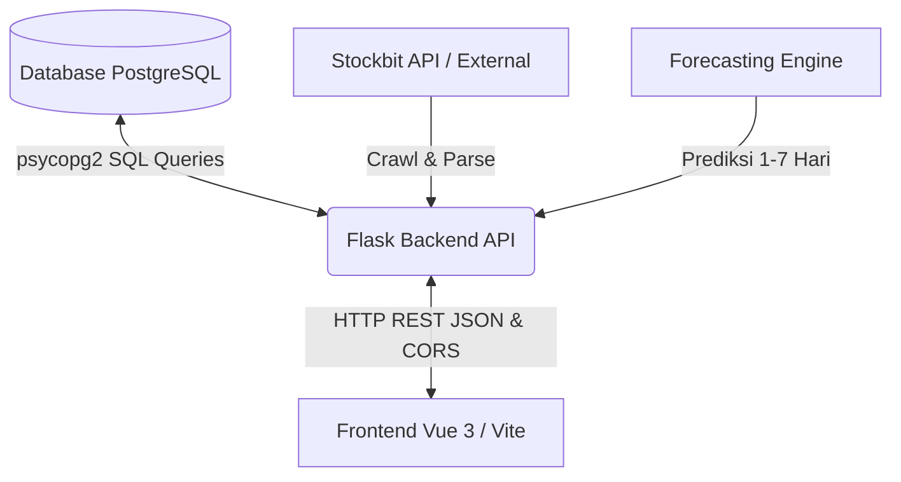

# Panduan Integrasi REST API (Backend - Frontend)

Dokumen ini memandu tim Frontend Vue/Vite dalam menghubungkan aplikasi antarmuka ke Flask Backend REST API.

---

## 📡 1. Spesifikasi Koneksi & CORS
* **Base URL Backend**: `http://localhost:8080` atau `http://127.0.0.1:8080` (dikustomisasi via `VITE_API_URL` di frontend).
* **CORS (Cross-Origin Resource Sharing)**: **Sudah diaktifkan** di backend. Frontend dev server di `http://localhost:5173` dapat langsung mengkonsumsi API tanpa kendala Same-Origin Policy.
* **Emiten Terdukung**: Backend secara ketat memvalidasi dan hanya memproses 5 emiten: **`BBCA`**, **`BBNI`**, **`BBRI`**, **`BMRI`**, dan **`BJBR`**. Permintaan dengan kode emiten di luar daftar ini akan mengembalikan **HTTP 400 Bad Request**.

---

## 🛠️ 2. Endpoint Trigger, Crawling & Scheduler

### A. Endpoint Trigger Crawling Manual
Meminta backend memicu pengambilan data dari Stockbit API ke database PostgreSQL:
* `GET /stock-info` — Snapshot harga emiten terbaru (`BBCA`, `BBNI`, `BBRI`, `BMRI`, `BJBR`).
* `GET /ohlc` — Data histori harga OHLC.
* `GET /broker-activity` — Ringkasan aktivitas broker / bandarmologi.
* `GET /majorholder` — Data transaksi orang dalam (insider trading).

> ⚠️ Endpoint crawl menggunakan HTTP `GET` dan prosesnya dapat memakan waktu beberapa detik.

### B. Endpoint Auto Scheduler
Mengontrol crawler otomatis yang berjalan di jam bursa:
* `GET /scheduler/status` — Status scheduler, info hari trading, jam bursa, dan riwayat eksekusi.
* `POST /scheduler/start` — Menyalakan scheduler.
* `POST /scheduler/stop` — Mematikan scheduler secara penuh.
* `POST /scheduler/pause` — Menghentikan sementara (pause) eksekusi scheduler.
* `POST /scheduler/resume` — Melanjutkan kembali scheduler yang di-pause.
* `POST /scheduler/trigger` — Memaksa crawler berjalan 1x saat itu juga (bypass jam bursa).

---

## 📊 3. Endpoint Query Data

Endpoint khusus untuk membaca data mentah dari PostgreSQL dan menampilkannya di antarmuka frontend:

### A. Data Stock Info (Snapshot Harga)
* **Endpoint**: `GET /api/data/stock-info`
* **Query Parameters**: `symbol` (Wajib, misal: `symbol=BBCA`)

### B. Data OHLC & Aliran Dana Asing (Foreign Flow)
* **Endpoint**: `GET /api/data/ohlc`
* **Query Parameters**: `symbol` (Wajib), `from` (Opsional), `to` (Opsional)

### C. Prediksi Harga Saham (Forecasting)
* **Endpoint**: `GET /api/data/forecast` *(Model ML Prediksi H+1 s.d H+7)*
* **Query Parameters**: `symbol` (Wajib), `days` (Opsional, default: 7)

### D. Ringkasan Broker (Broker Summary)
* **Endpoint**: `GET /api/data/broker-activity`
* **Query Parameters**: `symbol` (Opsional), `broker_code` (Opsional), `limit` (Opsional)

### E. Transaksi Orang Dalam (Majorholder / Insider)
* **Endpoint**: `GET /api/data/majorholder`
* **Query Parameters**: `symbol` (Opsional), `limit` (Opsional)

### F. Monitoring Status Crawling (Logs)
* **Endpoint**: `GET /crawl-status`
* **Query Parameters**: `limit` (Opsional, default `50`)

---

## 👤 4. Endpoint Pengguna & Watchlist

* **Login**: `POST /users/login` — Body: `{"email": "...", "password": "..."}`
* **Profil User**: `GET /users/<user_id>`
* **Update Profil**: `PUT /users/<user_id>` — Body: `{"default_ticker": "BBCA"}`
* **Watchlist User**: `GET /users/<user_id>/watchlists`
* **Tambah Watchlist**: `POST /users/<user_id>/watchlists`
* **Ubah Watchlist**: `PUT /users/<user_id>/watchlists/<wid>`

### Alur Reset Password (3 Langkah, Kode Berlaku 5 Menit):
1. `POST /users/reset-password/send-code` — Payload: `{"email": "..."}`
2. `POST /users/reset-password/verify-code` — Payload: `{"email": "...", "code": "..."}`
3. `POST /users/reset-password/reset` — Payload: `{"token": "...", "password": "..."}`

---

## 🔄 5. Pipeline Aliran Data

